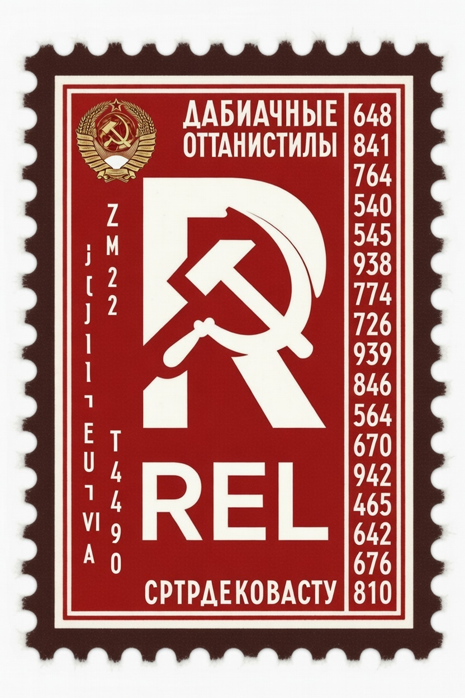

# DeadDrop / Relay

Farcaster-inspired SocialFi product combining token incentives, encrypted mailbox messaging, and DeadDrop sealed broadcasts.




## Repository Layout

- `apps/web` - React + Vite front end
- `apps/api` - Express API scaffold
- `apps/contracts` - Hardhat smart contracts (OpenZeppelin-based)
- `packages/shared` - shared types/constants
- `docs` - product, architecture, tokenomics, and roadmap docs
  - `docs/miniapp-preprod-prod-checklist.md` - Farcaster pre-prod/prod release checklist
  - `docs/railway-host-upload.md` - Railway deployment instructions

## Quick Start

```bash
npm install
npm run dev:api
```

Web app:
- single-domain via API service (prod): `https://<YOUR_APP_DOMAIN>`
- mini-app surface: `https://<YOUR_APP_DOMAIN>/?miniApp=true`

Local split dev (optional):
- web only: [http://localhost:5173](http://localhost:5173)

Farcaster manifest endpoints:
- [http://localhost:8787/.well-known/farcaster.json](http://localhost:8787/.well-known/farcaster.json)
- [http://localhost:8787/.well-known/miniapp.json](http://localhost:8787/.well-known/miniapp.json)

## Commands

- `npm run dev:web` - starts web app
- `npm run dev:api` - starts API app
- `npm run build` - builds all workspaces
- `npm run build --workspace=@deaddrop/contracts` - compile contracts
- `npm run lint --workspace=@deaddrop/contracts` - solhint checks
- `npm run test --workspace=@deaddrop/contracts` - contract tests
- `npm run deploy:sepolia --workspace=@deaddrop/contracts` - deploy contracts to Sepolia
- `npm run start:api` - production-style API start
- `npm run start:web` - production-style web start (uses `$PORT`)
- `npm run start` - Railway single-domain start (build web+api, run api)

## Farcaster Mini App Readiness

Aligned to [Farcaster Mini Apps getting started](https://miniapps.farcaster.xyz/docs/getting-started):

- Embed tags in `apps/web/index.html`:
  - `fc:miniapp`
  - `fc:frame`
- Runtime SDK readiness call in mini-app mode:
  - `apps/web/src/miniapp.ts`
- Manifest serving:
  - `/.well-known/farcaster.json`
- Quick Auth aware API actor resolution:
  - `apps/api/src/server.ts`
- Single-domain serving (API host serves built web bundle):
  - `apps/api/src/server.ts`

Pre-prod/prod env templates:
- `apps/web/.env.example`
- `apps/api/.env.example`
- `apps/contracts/.env.example`
- Node runtime pin: `.nvmrc`

## Implemented Now

- 4) FARM -> REL epoch conversion API + front-end controls
- 5) REL staking + governance voting API + front-end controls
- Mini-app support with manifest endpoint and mini-app rendering mode
- Mailbox support with inbox/thread read APIs and mini-app mailbox tab
- DM pricing by stake tier: base 1.00 USDC, -0.10 per 100 REL staked, floor 0.10
- Smart contract scaffold: `RelToken`, `StakingVault`, `FeeModel`
- Daily Brief NFT scaffold: `DailyBriefNFT`, `DailyBriefSVG`, `INftWeightOracle`

## Waitlist Admin + Offline Export

Waitlist signups persist to disk (default `./data/waitlist.json`) in the API service.
Signups are Farcaster identity-based (FID + username/profile), with dedupe by FID.

Required env for admin access:
- `ADMIN_API_KEY` (set a strong secret)
- `WAITLIST_STORAGE_PATH` (optional custom path)

Admin endpoints (protected with `x-admin-key` header or `Authorization: Bearer <key>`):
- `GET /v1/admin/waitlist` (JSON entries)
- `GET /v1/admin/waitlist.csv` (CSV download)

## Daily Cold War Brief Scaffold

File-backed content store (default `./data/coldwar-briefs.json`) for daily lessons/quotes.

Public endpoints:
- `GET /v1/brief/today` (today's brief, with fallback)
- `GET /v1/brief/archive?limit=7` (recent brief history)

Admin endpoints (protected by `ADMIN_API_KEY`):
- `GET /v1/admin/briefs` (JSON list)
- `POST /v1/admin/briefs` (bulk upsert from scraper payload `{ "items": [...] }`)

## Daily Brief NFT Commands

- `npm run prepare:pilot-briefs --workspace=@deaddrop/contracts`
- `npm run deploy:nft:sepolia --workspace=@deaddrop/contracts`
- `npm run configure:briefs:sepolia --workspace=@deaddrop/contracts`
- `npm run security:gates --workspace=@deaddrop/contracts`

Security gate docs:
- `docs/security/daily-brief-nft-threat-model.md`
- `docs/security/daily-brief-nft-security-gates.md`

## FOIA PDF -> Text Pack (Python)

Generate a clean text pack from one or more PDFs (split into 4-5 consumable docs):

```bash
python3 -m venv .venv
source .venv/bin/activate
pip install -r scripts/requirements-foia.txt

python3 scripts/foia_pdf_to_text_docs.py \
  --target-docs 5 \
  --outdir ./docs/foia-text-pack \
  "/path/to/CIA-RDP80B01554R003400160033-6.pdf" \
  "/path/to/delta.pdf" \
  "/path/to/Key-Ultra.pdf"
```

Output files:
- `00_manifest.txt`
- `01_foia_text_part_01.txt` ... `05_foia_text_part_05.txt`
- `01_foia_text_part_01.md` ... `05_foia_text_part_05.md`
- `all_foia_text_merged.md`

Notes:
- The script now runs an OCR regex cleanup pass by default to reduce common scan artifacts.
- To disable cleanup, add: `--skip-ocr-regex-clean`
